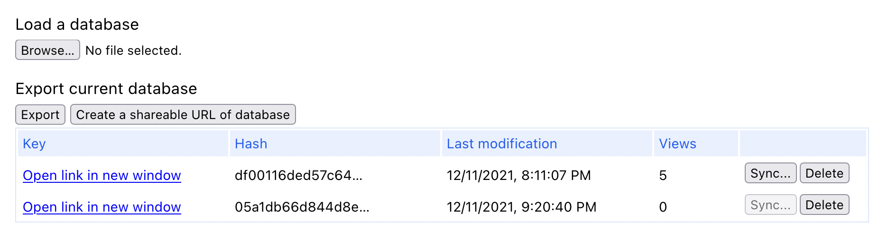

Cryptology and cryptography is an interdisciplinary field of study
in computer sciences and math. Cryptography in computer 
programming, covers the techniques of secure communication in
computer systems and internet. Secure communication is not something
nice to have, but it is something must to have in our times. That's why
cryptography is an inseparable field of study in computer sciences.

For example:

 - You have to provide an HTTPS connection to the users if you're serving a web-site in order to protect
your users confidential information.
 - You have to provide SHA1 checksums of the files that you have published in order
to proof that the file which users are reaching is original as you have published.
 - If you are going to store a password in your datases, you have to hash them with a strong hashing algorithm.

Any many more, especially with the block-chain based emerging technologies.

Also, not only for secure communication, but cryptology is something that we can use
to improve our applications in user experience context. In this blog post, I will share
how we can use cryptology in our web applications to provide a solid and consistent 
user interfaces to the users.

### Unique ID validation

Using a universally unique ID is a very common technique in web applications to 
label a record. Creating a random string or a number is a very complicated process
in computer systems. UUID provides us a framework to create a secure unique id for
an entity.

By using UUID, we can also validate the unique id's in our applications. It's a handy 
practice, lets imagine an e-commerce application and we are developing the detail page
of a product.

The endpoint could be something like that:

    https://my-ecommerce-platform.com/amazing-product

After a while, you will notice that this is not a good practice, because you can have
a same name for a different product. Then you are going to change the URL as

    https://my-ecommerce-platform.com/amazing-product-2

And after a while, yet another product name for a different product. You need to generate
a slug (human-readable-url) part for the record, but it is not something that easy as well.

It is going to be something like:

    https://my-ecommerce-platform.com/amazing-product-(number-of-duplications)

I don't think number of duplications is a relavent information to be included in a URL and
it has drawbacks in technical context.

It needs to be like:

    https://my-ecommerce-platform.com/08cc93fe-9093-4835-8515-ddc0741d0b51

Or if the name of the product is important in URL:

    https://my-ecommerce-platform.com/amazing-product-08cc93fe-9093-4835-8515-ddc0741d0b51

That unique part of the URL is generated by using a Universally Unique Identifier. The same
framework also provides us validation for a Unique ID. With that validation, we can
check if the unique id is generated based on the rules of UUID or not.

With that validation, we can distinquish the unique id's and not related information. For example

    https://my-ecommerce-platform.com/08cc93fe-9093-4835-8515-ddc0741d0b51
    Responds with HTTP 200 OK

    https://my-ecommerce-platform.com/[not-a-valid-unique-id]
    Responds with HTTP 404 Not Found

We can validate the unique ID and respond 404 without hitting to the database. All the
UUID modules comes with a validation function, such as <a href="https://www.npmjs.com/package/uuid">uuid</a>
in NPM.

### Application state synchronization

This is something is useful in frontend applications. In frontend application,
we store the UI's state and synchronize them with the server in most of the cases.

We always generate an hash for the UI state of the application. When there needs to
be something synched with the server, we check the hash of user interface state
with the remote hash, and if they are different, we proceed the synchronization,
if not, we skip.

```javascript

export const hashApplicationState = (applicationState: ApplicationState) => {
  return sha1(JSON.stringify(worklogEntries)).toString();
};
```

We can use `sha1` algorithm for generating a hash of content.

The hash will be looking like:

    df00116ded57c6495b96b23f80f8aa55e98df3b3

We can use <a href="https://cryptojs.gitbook.io/docs/">crypto-js</a> library for the sha1 algorithm.

Here's an example use case for that technique.

<figure>

<figcaption>Content synchronized by hashes.</figcaption>
</figure>

In the figure above, the application state is synchronized with hashes and the date
modification shows the time when the entry was updated. If you have noticed,
not all the `Sync...` buttons are clickable. The button rendered as disabled
if the hash of the record is the same with the current state of the application.

Same technique is used for generating checksums of the files. This was just an 
example. I think it's worth to invest some time in cryptography and practice by
using in side-projects.

Happy hacking!
